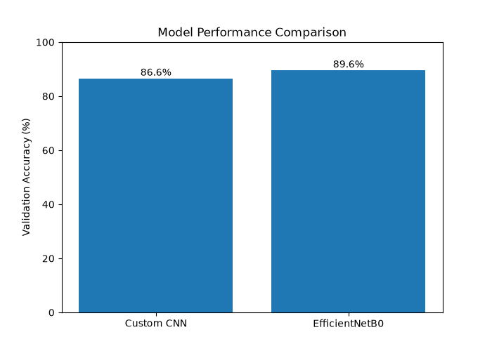
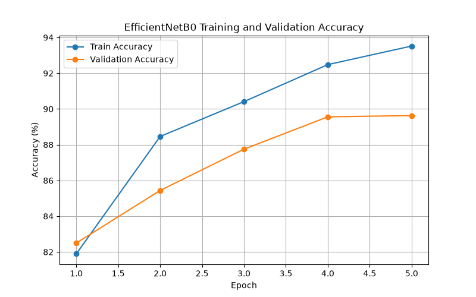
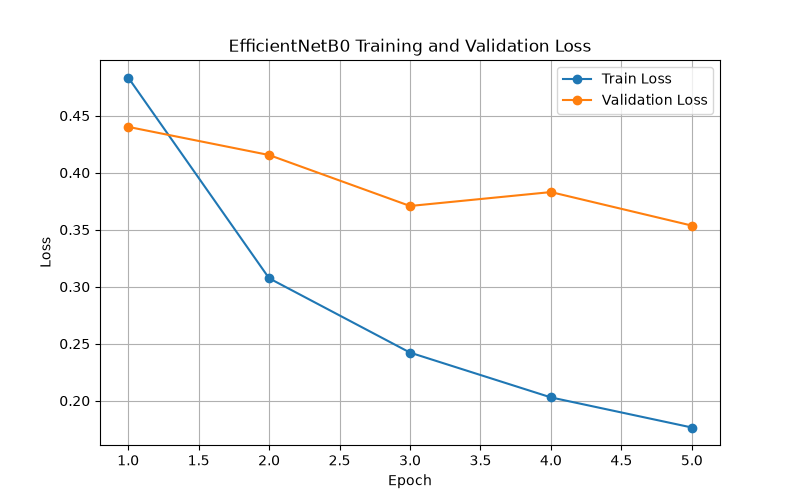
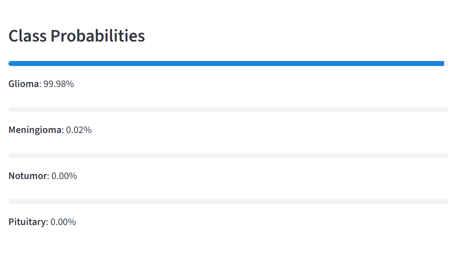
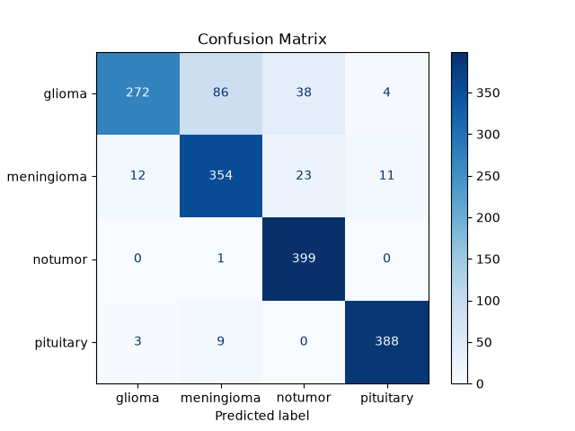

# Brain Tumor Classification with CNN

This project uses a Convolutional Neural Network (CNN) to classify brain MRI images into four categories:

- Glioma
- Meningioma
- Pituitary Tumor
- No Tumor

## Technologies

- Python
- TensorFlow / Keras
- NumPy
- Matplotlib

## Dataset Structure

dataset/
├── Training/
├── Testing/

## Current Results

- Training Accuracy: ~98%
- Validation Accuracy: ~86%

## Future Improvements

- Streamlit Web Application
- Better CNN Architecture
- Data Augmentation
- Model Evaluation Metrics
# Brain MRI Tumor Classification

This project focuses on the classification of brain MRI images using deep learning techniques.  
The system classifies MRI images into four categories:

- Glioma
- Meningioma
- No Tumor
- Pituitary Tumor

The project includes a baseline Convolutional Neural Network (CNN), an improved transfer learning model using EfficientNetB0, model evaluation with confusion matrix and classification report, and a Streamlit-based web application for real-time MRI image prediction.

## Project Overview

The main goal of this project is to build a deep learning model that can classify brain MRI images into different tumor categories.  
The project started with a custom CNN model and was later improved using transfer learning with EfficientNetB0.

The final model is integrated into a simple web interface where users can upload an MRI image and receive:

- Predicted tumor class
- Confidence score
- Class probability distribution
## Dataset

The dataset consists of brain MRI images collected for tumor classification tasks.

### Classes

- Glioma
- Meningioma
- No Tumor
- Pituitary Tumor

### Dataset Distribution

| Dataset Split | Images |
|--------------|--------:|
| Training | 5600 |
| Testing | 1600 |
| Total | 7200 |

The dataset is balanced, with each class containing an equal number of images.

---

## Models Used

### 1. Custom CNN

A custom Convolutional Neural Network was developed using:

- Conv2D Layers
- MaxPooling Layers
- Dense Layers
- ReLU Activation
- Softmax Output Layer

### 2. Transfer Learning - EfficientNetB0

To improve performance, EfficientNetB0 pretrained on ImageNet was used.

Key features:

- Pretrained ImageNet weights
- Frozen feature extractor
- Custom classification head
- Dropout regularization
- Softmax classification

---

## Results

### Model Comparison

| Model | Validation Accuracy |
|--------|-------------------:|
| Custom CNN | 86.6% |
| EfficientNetB0 Transfer Learning | 89.6% |

The transfer learning approach outperformed the custom CNN model and produced more stable predictions.
---

## Web Application

A Streamlit-based web application was developed for real-time MRI image classification.

### Features

- Upload Brain MRI Image
- Predict Tumor Type
- Display Confidence Score
- Show Class Probability Distribution
- User-Friendly Interface

### Example Prediction

The application displays:

- Uploaded MRI image
- Predicted class
- Confidence percentage
- Probability scores for all classes
---

## How to Run

### Clone Repository

```bash
git clone https://github.com/kadriyeisik/brain-mri-tumor-classification.git
```

### Install Dependencies

```bash
pip install -r requirements.txt
```

### Train CNN Model

```bash
python train_model.py
```

### Train EfficientNet Model

```bash
python train_transfer_model.py
```

### Run Streamlit Application

```bash
streamlit run app.py
```
---

## Future Improvements

- Fine-Tuning EfficientNetB0
- Data Augmentation
- Model Explainability (Grad-CAM)
- Hyperparameter Optimization
- Deployment on Cloud Platforms
- Mobile Application Integration
---

## Disclaimer

This project is intended for educational and research purposes only.

The predictions generated by the model should not be considered medical advice, diagnosis, or treatment recommendations.

Always consult qualified healthcare professionals for medical decisions.
---

## Model Performance Comparison

### CNN vs EfficientNetB0



---

## EfficientNetB0 Training Accuracy



---

## EfficientNetB0 Training Loss



---

## Web Application

### Main Interface


### Probability Distribution Example



---

## EfficientNet Evaluation

### Confusion Matrix

